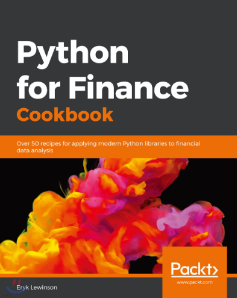

# Finance-DataAnalysis

- Lewinson, E. (2019). Python for Finance Cookbook. Packt Publishing.

### **Solve common and not-so-common financial problems using Python libraries such as NumPy, SciPy, and pandas**

### **Key Features**
- Use powerful Python libraries such as pandas, NumPy, and SciPy to analyze your financial data
- Explore unique recipes for financial data analysis and processing with Python
- Estimate popular financial models such as CAPM and GARCH using a problem-solution approach

### **Book Description**
Python is one of the most popular programming languages used in the financial industry, with a huge set of accompanying libraries.

In this book, you'll cover different ways of downloading financial data and preparing it for modeling. You'll calculate popular indicators used in technical analysis, such as Bollinger Bands, MACD, RSI, and backtest automatic trading strategies. Next, you'll cover time series analysis and models, such as exponential smoothing, ARIMA, and GARCH (including multivariate specifications), before exploring the popular CAPM and the Fama-French three-factor model. You'll then discover how to optimize asset allocation and use Monte Carlo simulations for tasks such as calculating the price of American options and estimating the Value at Risk (VaR). In later chapters, you'll work through an entire data science project in the financial domain. You'll also learn how to solve the credit card fraud and default problems using advanced classifiers such as random forest, XGBoost, LightGBM, and stacked models. You'll then be able to tune the hyperparameters of the models and handle class imbalance. Finally, you'll focus on learning how to use deep learning (PyTorch) for approaching financial tasks.

By the end of this book, you'll have learned how to effectively analyze financial data using a recipe-based approach.

### **What you will learn**

- Download and preprocess financial data from different sources
- Backtest the performance of automatic trading strategies in a real-world setting
- Estimate financial econometrics models in Python and interpret their results
- Use Monte Carlo simulations for a variety of tasks such as derivatives valuation and risk assessment
- Improve the performance of financial models with the latest Python libraries
- Apply machine learning and deep learning techniques to solve different financial problems
- Understand the different approaches used to model financial time series data

### **Who this book is for**

This book is for financial analysts, data analysts, and Python developers who want to learn how to implement a broad range of tasks in the finance domain. Data scientists looking to devise intelligent financial strategies to perform efficient financial analysis will also find this book useful. Working knowledge of the Python programming language is mandatory to grasp the concepts covered in the book effectively.

## 목차

1. Financial Data and Preprocessing
2. Technical Analysis in Python
3. Time Series Modelling
4. Multi-factor Models
5. Modeling Volatility with GARCH class models
6. Monte Carlo Simulations in Finance
7. Asset Allocation in Python
8. Identifying Credit Default with Machine Learning
9. Advanced Machine Learning Models in Finance
10. Deep Learning in Finance